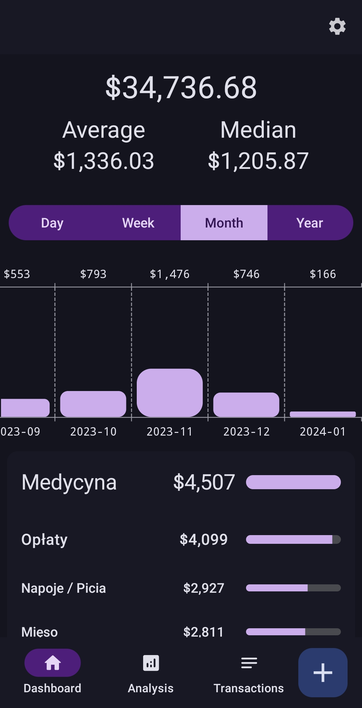
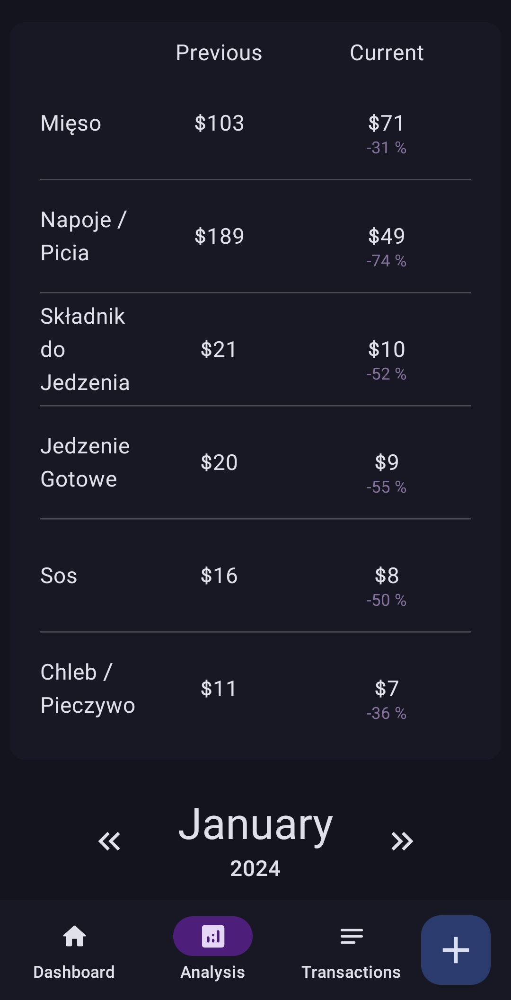
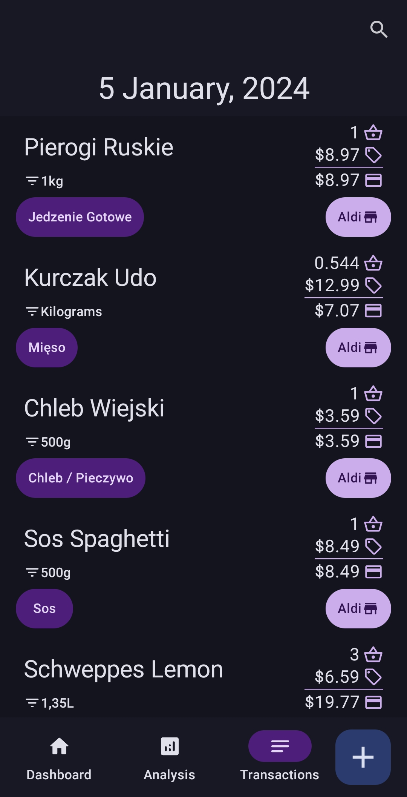
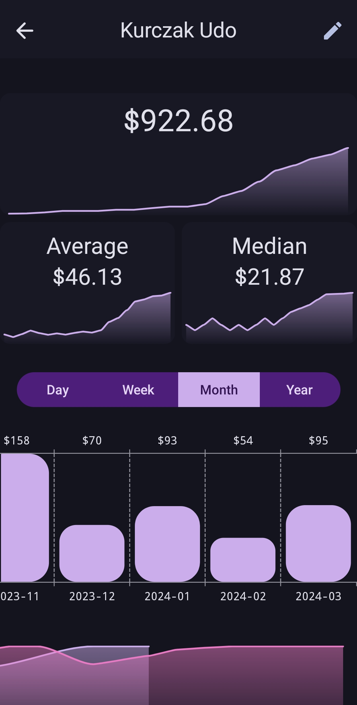
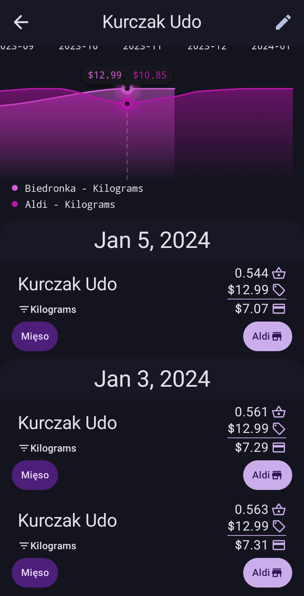
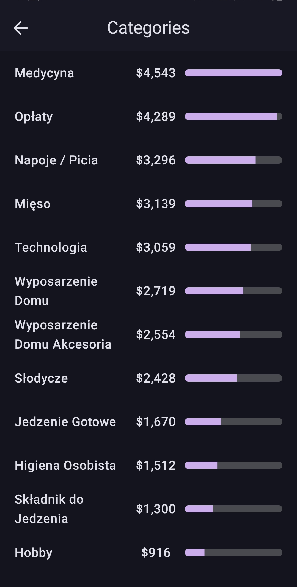
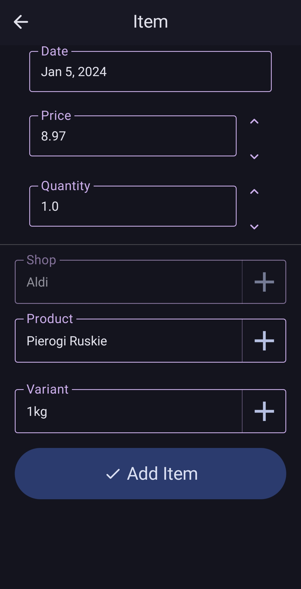
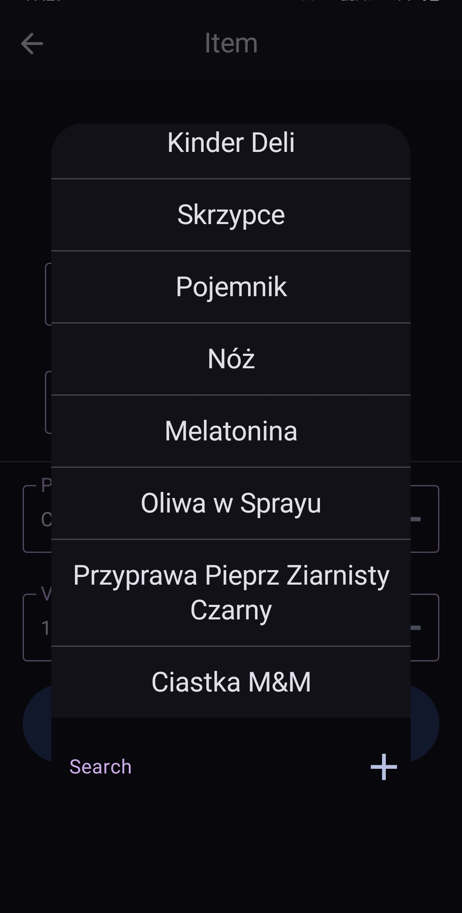
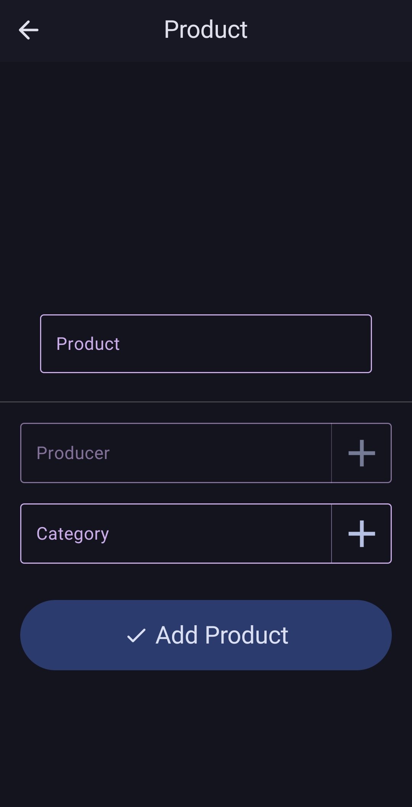

<h1 align="center">Arrugarq</h1>

 

  
  
  
  

<h4 align="center">Arrugarq is an app for expenditure tracking/analysis</h4>

    
    
    
    
    
    
    
    
    
    

# Features

- Light/Dark mode
- Support for Polish and English languages
- Merging capabilities for categories, shops, products and producers
- Comparisons between prices at different shops
- Ranking of categories and shops based on total money spent

### TBD

- Alternative names for Products and Product Categories for easier searching
- Filtering for easier searching

# Tech Stack & Libraries

- Developed in Android Studio Iguana (currently on version `RC 1`)

- [Kotlin](https://kotlinlang.org/) based

- [Coroutines](https://github.com/Kotlin/kotlinx.coroutines) for asynchronous computing

- [Flow](https://kotlin.github.io/kotlinx.coroutines/kotlinx-coroutines-core/kotlinx.coroutines.flow/) to emit values from data layer reactively

- [Accompanist](https://github.com/google/accompanist) to extend jetpack compose

- [Hilt](https://dagger.dev/hilt/) for dependency injection

- [Compose Navigation Reimagined](https://github.com/olshevski/compose-navigation-reimagined) for animated navigation

- [Vico Compose](https://github.com/patrykandpatrick/vico) for graphs

- [Fuzzywuzzy](https://github.com/xdrop/fuzzywuzzy) for fuzzy searching capabilities

- Jetpack
  - [Compose](https://developer.android.com/jetpack/compose) - Modern Declarative UI style framework based on composable functions

  - [Room](https://developer.android.com/jetpack/androidx/releases/room) - Persistence library providing abstraction layer over SQLite

  - [Material You Kit](https://developer.android.com/jetpack/androidx/releases/compose-material3) - Material 3 powerful UI components

  - [ViewModel](https://developer.android.com/topic/libraries/architecture/viewmodel) - Manages UI-related data holder and lifecycle awareness. Allows data to survive configuration changes such as screen rotations

  - [Lifecycle](https://developer.android.com/jetpack/androidx/releases/lifecycle) - Observe Android lifecycles and handle UI states upon the lifecycle changes
  